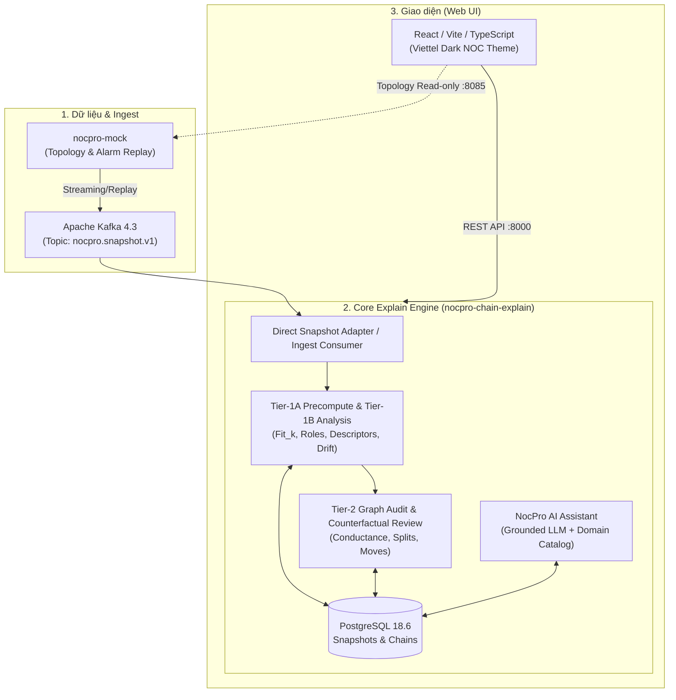

# Hindsight

> **See the bigger picture behind alarm chains**  
> *Hệ thống giải trình, kiểm định và tối ưu hóa chuỗi cảnh báo cho mạng lưới NOC Viettel (Alarm Chain Explanation, Audit & Counterfactual Optimization).*

---

## 📌 Mục lục

- [Tổng quan dự án](#-tổng-quan-dự-án)
- [Kiến trúc hệ thống](#-kiến-trúc-hệ-thống)
- [Yêu cầu môi trường (Prerequisites)](#-yêu-cầu-môi-trường-prerequisites)
- [1. Chế độ chạy LOCAL (Phát triển & Debug nhanh)](#1-chế-độ-chạy-local-phát-triển--debug-nhanh)
  - [Cài đặt thư viện](#cài-đặt-thư-viện)
  - [Chạy tất cả với 1 lệnh (`make dev`)](#chạy-tất-cả-với-1-lệnh-make-dev)
  - [Chạy từng service riêng biệt](#chạy-từng-service-riêng-biệt)
- [2. Chế độ chạy PRODUCT / PRODUCTION (Docker Compose)](#2-chế-độ-chạy-product--production-docker-compose)
  - [Khởi động toàn bộ Stack (`make prod`)](#khởi-động-toàn-bộ-stack-make-prod)
  - [Cổng dịch vụ & Danh sách container](#cổng-dịch-vụ--danh-sách-container)
  - [Các lệnh quản trị stack Docker](#các-lệnh-quản-trị-stack-docker)
  - [Cấu hình biến môi trường (`.env`)](#cấu-hình-biến-môi-trường-env)
- [3. Quy trình CI/CD & Deploy tự động](#3-quy-trình-cicd--deploy-tự-động)
- [4. Kiểm thử & Đảm bảo chất lượng (Testing)](#4-kiểm-thử--đảm-bảo-chất-lượng-testing)
- [Cấu trúc thư mục](#-cấu-trúc-thư-mục)

---

## 📖 Tổng quan dự án

Trong hệ thống giám sát viễn thông (NOC), hàng triệu cảnh báo phát sinh tạo thành các chuỗi cảnh báo dài và phức tạp (*Alarm Chains*). **Hindsight** giải quyết bài toán:
1. **Giải trình nguồn gốc (Tier-1 Explanation):** Tính toán độ phù hợp (`Fit_k`, `Fit_g`), nhận diện vai trò thành viên (*ROOT, SYMPTOM, STRUCTURAL, REDUNDANCY*), bóc tách motif cảnh báo theo thời gian và topology.
2. **Kiểm định đồ thị & Phát hiện over-merge (Tier-2 Audit):** Áp dụng vết cắt đồ thị xác định (*deterministic cuts, conductance*) để phát hiện các chuỗi bị gộp nhầm (*over-merge verdict*).
3. **Đánh giá phản thực tế (Counterfactual Review):** Đề xuất hành động tối ưu chuỗi (`REMOVE_MEMBER`, `SPLIT_CHAIN`, `MOVE_MEMBER`, `MERGE_CHAINS`) với cơ chế kiểm thử an toàn trước khi áp dụng.
4. **NocPro AI Assistant:** Trợ lý LLM tương tác có khả năng tra cứu tri thức miền viễn thông, bối cảnh chuỗi hiện tại và đề xuất giải pháp xử lý sự cố.
5. **Giao diện người dùng Dark NOC:** Xây dựng theo tiêu chuẩn thiết kế Viettel NOC với tính năng quản lý snapshot, cây chuỗi cảnh báo, audit và validation.

---

## 🏛️ Kiến trúc hệ thống



---

## 🛠️ Yêu cầu môi trường (Prerequisites)

- **Python:** Phiên bản `>= 3.12` (Khuyến nghị cài đặt công cụ quản lý [`uv`](https://github.com/astral-sh/uv) để cài thư viện siêu tốc).
- **Node.js:** Phiên bản `>= 20` và trình quản lý gói [`pnpm`](https://pnpm.io/) (hoặc `npm`).
- **Docker & Docker Compose:** Cần thiết khi chạy chế độ **Product / Production** hoặc chạy qua container.
- **Make:** Dùng để chạy nhanh các lệnh tiện ích có sẵn trong file `Makefile`.

---

## 1. Chế độ chạy LOCAL (Phát triển & Debug nhanh)

> Chế độ này dành cho lập trình viên phát triển tính năng, sửa đổi frontend/backend hoặc debug logic thuật toán. **Không cần cài đặt hay chạy Docker và Kafka**, dữ liệu snapshot mặc định được nạp sẵn vào bộ nhớ siêu tốc.

### Cài đặt thư viện

Chỉ cần chạy 1 lệnh để tự động đồng bộ môi trường ảo Python bằng `uv` và cài đặt toàn bộ `node_modules` bằng `pnpm`:

```bash
make install
```

### Chạy tất cả với 1 lệnh (`make dev`)

Khởi động đồng thời cả 3 thành phần (Web Frontend, Backend API, Mock Server) trong cùng một terminal:

```bash
make dev
```

*Terminal sẽ hiển thị log của cả 3 dịch vụ với tiền tố màu sắc riêng biệt. Nhấn `Ctrl + C` để dừng toàn bộ các tiến trình một cách an toàn.*

| Thành phần | URL truy cập | Mô tả |
|---|---|---|
| **Web UI (Explain Dashboard)** | `http://127.0.0.1:5173` | Giao diện chính: Snapshot Overview, Chains Explorer, Chain Detail, Validation & Counterfactual Review, AI Assistant. |
| **Backend API** | `http://127.0.0.1:8000` | FastAPI server (`--reload` tự động tải lại code khi sửa). |
| **Tài liệu API (Swagger UI)** | `http://127.0.0.1:8000/docs` | OpenAPI documentation tương tác trực tiếp với API endpoints. |
| **Mock Server & Topology UI** | `http://127.0.0.1:8085` | Giả lập dữ liệu chuỗi, sơ đồ topology và hỗ trợ phát lại (replay) cảnh báo. |

### Chạy từng service riêng biệt

Khi cần mở riêng từng tiến trình hoặc debug chi tiết một dịch vụ cụ thể:

- **Chỉ chạy Backend API (FastAPI, không Kafka):**
  ```bash
  make dev-api
  ```
  *(Cấu hình mặc định: `KAFKA_ENABLED=false`, `AUTO_SEED_DEFAULT_SNAPSHOT=true`, cổng `8000`)*

- **Chỉ chạy Web Frontend (React + Vite Hot-Reload):**
  ```bash
  make dev-web
  # hoặc lệnh ngắn:
  make ui
  ```
  *(Khởi chạy tại cổng `5173`)*

- **Chỉ chạy NocPro Mock Server:**
  ```bash
  make dev-mock
  ```
  *(Khởi chạy tại cổng `8085`)*

---

## 2. Chế độ chạy PRODUCT / PRODUCTION (Docker Compose)

> Chế độ này đóng gói toàn bộ hệ sinh thái thành các Docker container hoàn chỉnh, bao gồm **PostgreSQL 18.6**, **Apache Kafka 4.3**, dịch vụ API, worker phân tích và Nginx web server phục vụ bản build production.

### Khởi động toàn bộ Stack (`make prod`)

Để build và chạy toàn bộ container dưới nền (detached mode):

```bash
make prod
# hoặc
make product
```

*Lệnh trên tương đương với:*
```bash
docker compose -f nocpro-chain-explain/docker-compose.yml up --build -d
```

### Cổng dịch vụ & Danh sách container

Khi chạy ở chế độ Production, hệ thống lắng nghe trên các cổng tiêu chuẩn:

| Container | Cổng Host | Vai trò & Công nghệ |
|---|---|---|
| **web** | `http://localhost:3000` | Production Web UI đóng gói qua Docker Nginx server. |
| **api** | `http://localhost:8000` | FastAPI core service kết nối Kafka và PostgreSQL. |
| **mock-ui** | `http://localhost:8085` | NocPro Mock Topology & Replay UI server. |
| **kafka** | `localhost:9092` | Apache Kafka Broker xử lý streaming dữ liệu cảnh báo lớn theo batch/chunk. |
| **postgres** | `localhost:5432` | Cơ sở dữ liệu lưu trữ snapshots, metadata, chains, audit results. |
| **migrate** | *(Chạy 1 lần)* | Tự động chạy Alembic migrations (`alembic upgrade head`) trước khi API khởi động. |
| **kafka-init** | *(Chạy 1 lần)* | Tự động khởi tạo các topics: `nocpro.snapshot.v1` và `nocpro.snapshot.v1.dlq`. |

### Các lệnh quản trị stack Docker

- **Xem log hệ thống thời gian thực:**
  ```bash
  make logs
  ```
- **Kiểm tra trạng thái các container:**
  ```bash
  make status
  ```
- **Dừng và giải phóng toàn bộ container:**
  ```bash
  make down
  ```

### Cấu hình biến môi trường (`.env`)

Bạn có thể tuỳ chỉnh các tham số kết nối hoặc AI provider tại file `nocpro-chain-explain/.env`:

```bash
# NocPro AI Assistant (ADR-0024)
AI_PROVIDER_PROTOCOL=OLLAMA           # Tuỳ chọn: OLLAMA hoặc OPENAI_COMPATIBLE
AI_BASE_URL=https://ollama.com/api    # URL của LLM provider
AI_API_KEY=your-api-key-here          # API key (nếu cần)
AI_MODEL=gpt-oss:120b                 # Model ID sử dụng

# Webhook gọi ngược lại hệ thống upstream NOC để thực hiện mutation
NOCPRO_MUTATION_WEBHOOK_URL=http://localhost:8085/api/webhook/mutation
```

---

## 3. Quy trình CI/CD & Deploy tự động

Dự án tích hợp đầy đủ hệ thống tự động hoá qua GitHub Actions:

### 1. Continuous Integration (CI) - `.github/workflows/ci.yml`
- **Kích hoạt:** Khi tạo Pull Request hoặc Push vào các nhánh `main`, `dev`, `product`.
- **Nhiệm vụ kiểm tra:**
  1. Cài đặt môi trường chuẩn với Python 3.12 (`uv`) và Node.js 22 (`pnpm`).
  2. Kiểm tra linter code style: `make lint`.
  3. Chạy kiểm thử Backend API: `make test-backend`.
  4. Chạy kiểm thử Mock Server: `make test-mock`.
  5. Chạy kiểm thử Web UI Vitest: `make test-ui`.

### 2. Continuous Deployment (CD) - `.github/workflows/cd.yml`
- **Kích hoạt:** Khi có commit mới được merge/push vào nhánh `product`.
- **Quy trình thực thi:**
  1. **Build & Push:** Sử dụng Docker Buildx xây dựng các Docker image và lưu trữ trên GitHub Container Registry (GHCR):
     - `ghcr.io/vu-quoc-tuan/hindsight-api:latest`
     - `ghcr.io/vu-quoc-tuan/hindsight-web:latest`
     - `ghcr.io/vu-quoc-tuan/hindsight-mock:latest`
  2. **Deploy to Server:** Runner máy chủ (`tuanvdt`) tự động:
     - Kéo các images mới nhất từ GHCR về server.
     - Cấu hình file secrets `.env` sản xuất từ `PROD_ENV`.
     - Khởi động hệ thống với `docker compose up -d --no-build`.
     - Tự động dọn dẹp ảnh Docker cũ (`docker image prune -f`) để tối ưu dung lượng đĩa cứng.
     - Kiểm tra sức khỏe hệ thống (Health Check) tại `http://127.0.0.1:8000/api/v1/health` và `http://127.0.0.1:8085/`.

---

## 4. Kiểm thử & Đảm bảo chất lượng (Testing)

Dự án có bộ test suite hoàn chỉnh từ unit test, integration test đến frontend component test:

- **Chạy bộ test nhanh thường dùng (Recommended):**
  ```bash
  make test
  # hoặc
  make test-fast
  ```
  *Chạy lướt qua các test case quan trọng của Backend, Mock UI và Frontend Vitest trong vài giây.*

- **Chạy chi tiết từng bộ phận:**
  ```bash
  make test-backend   # Kiểm tra Explain API, LLM Assistant, Grounded Reasoning
  make test-mock      # Kiểm tra Mock server, Topology, Slicer
  make test-ui        # Kiểm tra Web components và logic giao diện (Vitest)
  ```

- **Chạy toàn bộ comprehensive test suite:**
  ```bash
  make test-full
  ```
  *(Bao gồm hơn 750+ unit tests và 225 replay scenario fixtures).*

- **Dọn dẹp cache & build artifacts:**
  ```bash
  make clean
  ```

---

## 📂 Cấu trúc thư mục

```text
hindsight/
├── Makefile                                # Bộ lệnh điều khiển toàn bộ dự án (dev, prod, test, install)
├── README.md                               # Tài liệu hướng dẫn sử dụng và vận hành dự án
├── .github/workflows/
│   ├── ci.yml                              # Pipeline CI: Lint & Unit tests
│   └── cd.yml                              # Pipeline CD: Build GHCR & Deploy server
│
├── nocpro-chain-explain/                   # [Core Service] Engine giải trình & Web UI
│   ├── docker-compose.yml                  # Stack Production đầy đủ (API, Web, Kafka, Postgres)
│   ├── services/
│   │   ├── api/                            # FastAPI backend service
│   │   ├── analysis-worker/                # Worker phân tích Tier-1 & Tier-2
│   │   └── web/                            # React + Vite Web UI (Viettel Dark NOC theme)
│   ├── libs/                               # Thư viện dùng chung (contracts, provenance, ...)
│   ├── config/thresholds/                  # Cấu hình ngưỡng phân tích (calibrated.yaml)
│   └── tests/                              # Bộ kiểm thử cho Backend & Assistant
│
├── nocpro-mock/                            # [Mock Service] Giả lập dữ liệu & Topology
│   ├── src/nocpro_mock/                    # Mã nguồn mock server & replay CLI
│   ├── datasets/                           # Dữ liệu cảnh báo và topology viễn thông
│   └── tests/                              # Bộ kiểm thử Mock server
│
└── docs/                                   # Tài liệu đặc tả kỹ thuật, ADRs và roadmap tích hợp
```

---

## 🤝 Đóng góp & Bản quyền

Dự án được nghiên cứu và phát triển nhằm tối ưu hoá quy trình vận hành chuỗi cảnh báo NOC viễn thông. Mọi thắc mắc hoặc đóng góp vui lòng mở Issue hoặc Pull Request trên repository.
